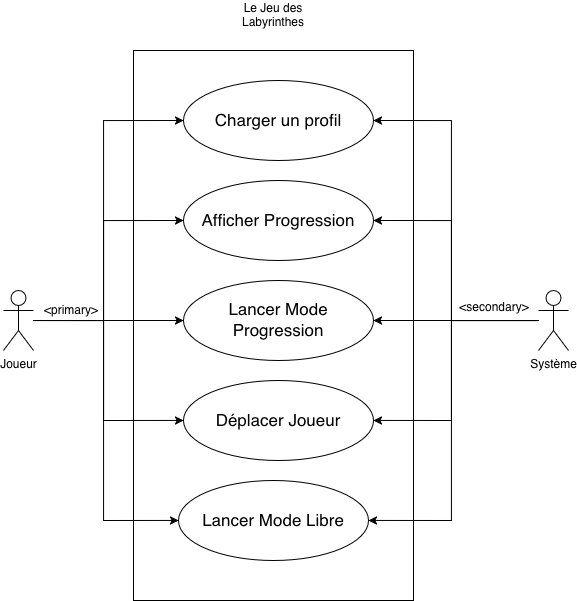
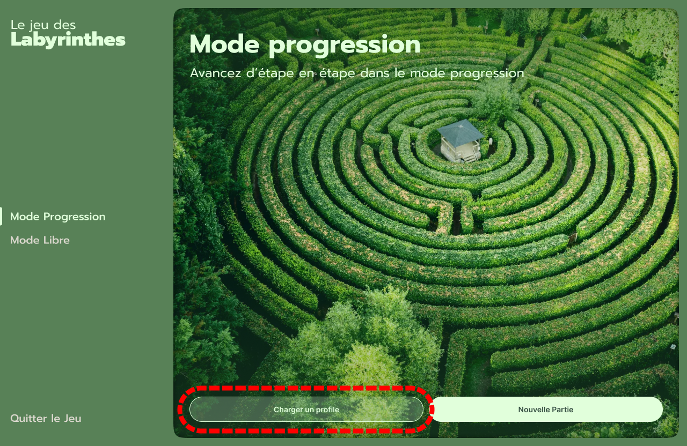
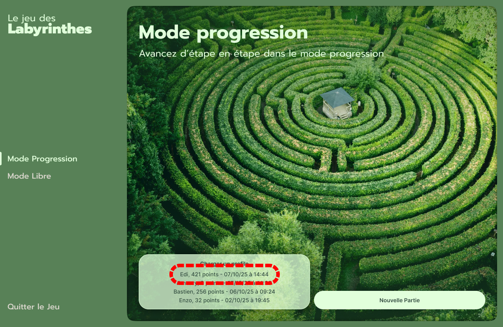
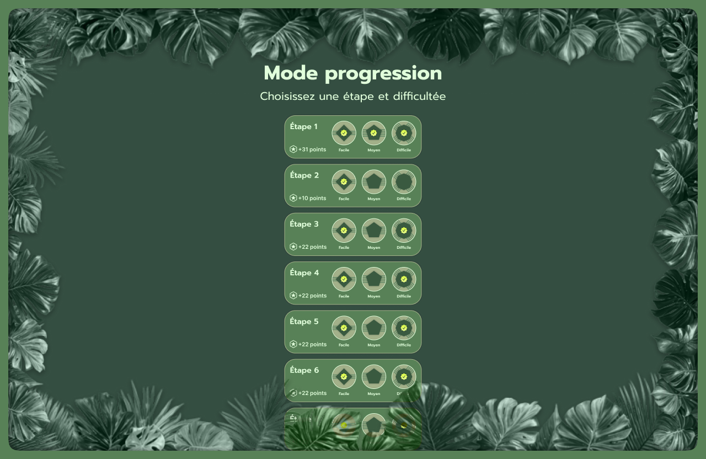
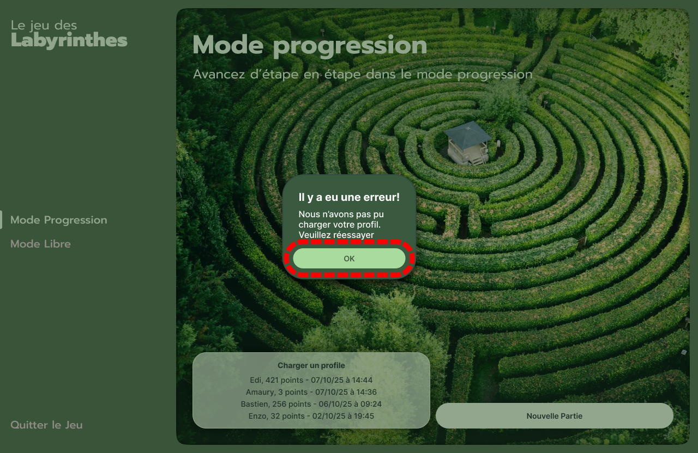
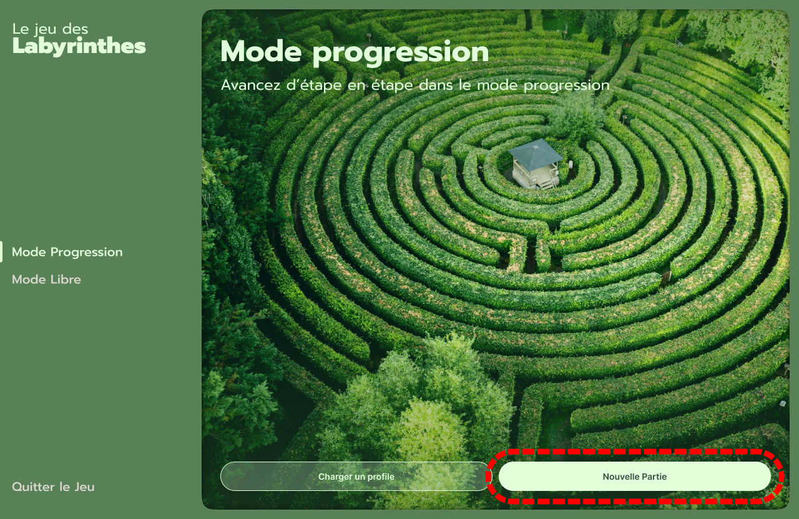
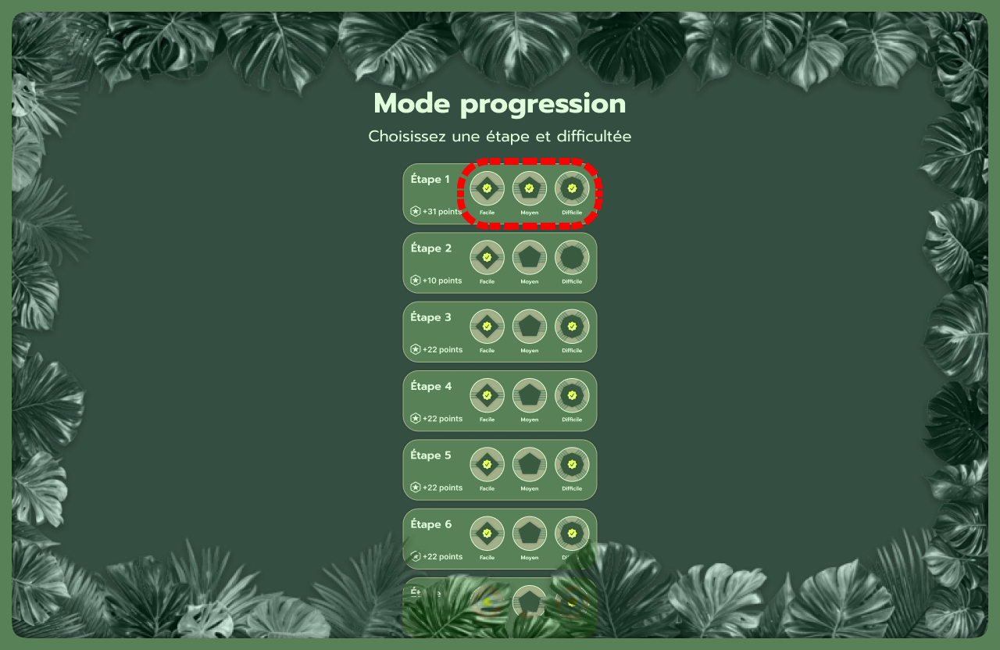
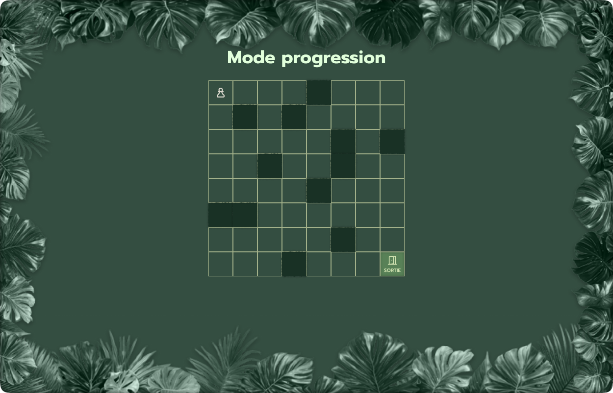
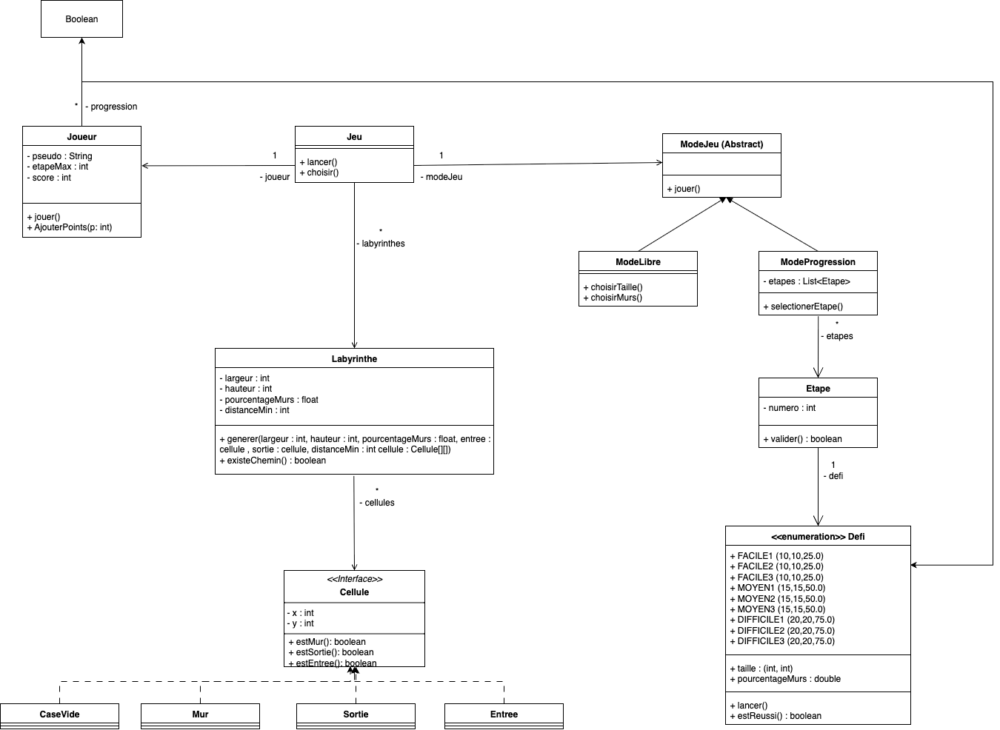

# Le Jeu des Labyrinthes

## Équipe et organisation du travail

Équipe I5:
- Fernandes Bastien : A contribué à la fiche descriptive de lancer mode progression
- Dewaele Enzo : A contribué à la fiche descriptive d'afficher la progression
- Hamiti Edi : A contribué à la fiche descriptive de charger un profil
- Vanhoutte Amaury : A contribué à la fiche descriptive de déplacer le joueur

## Diagrammes de cas d’utilisation

## Fiches descriptives

### Charger un profil
Système : Labyrinthes 

CU : Charger un profil

Acteur Principal : Joueuse

Acteur Secondaire : Système

Pré-conditions :
* Avoir un profil déjà sauvegardé
* La joueuse a déjà lancé le mode progression

Garantie en cas de succès :
* Un profil est chargé.

Garantie minimale :
* Si le scénario n’aboutit pas, l’état du système reste inchangé.

Scénario nominal : 
1. La joueuse sélectionne “Charger un profil”
2. Le système affiche la liste des profils à charger
3. La joueuse sélectionne le profile à charger
4. Le système charge le profile

   
Scénario alternatif :
A : Dans l'étape 4, il y a une erreur durant le chargement du profil
* 4(A) : Le système affiche une notification et revient à l'étape 2 du scénario nominal
* 5(A) : La joueuse sélectionne "OK"
* *Retour à l'étape 2 du scénario nominal*

### Afficher la progression
Système : Labyrinthes

CU : Afficher la progression

Acteur Principal : Système

Acteur Secondaire : Joueur

Pré-condition : 
 * Lancer le mode progression

Garantie en cas de succès : 
 * Afficher la progression du joueur

Garantie minimale :
 * Rien ne se passe

Scénario nominal : 
1. L’utilisateur lance le mode progression
2. Le système charge la progression du joueur et affiche les niveaux 

### Lancer mode progression

Système : Labyrinthes

CU : Lancer le Mode Progression

Acteur Principal : Joueur

Acteur Secondaire : Système

Pré-condition :
* Le joueur est sur l'interface de choix de mode de jeu

Garantie en cas de succès :
* Le labyrinthe s’affiche et l’utilisateur peut jouer

Garantie minimale :
* Rien ne se passe

Scénario nominal : 
1. Le joueur choisit le mode progression
2. Le système affiche la progression du joueur
3. Le joueur choisit un niveau parmi ceux débloqués 
4. Le système génère le labyrinthe avec les paramètres du niveau, il affiche le labyrinthe et permet au joueur de jouer 

Scénario alternatif : 
1. L’utilisateur choisit de charger une partie (retour étape 2 scénario nominal).

### Déplacer joueur

Système : Labyrinthes
                
CU : Déplacer le joueur

Acteur Principal : Joueur

Acteur Secondaire : Système

Pré-condition : 

* être en jeu

Garantie en cas de succès : 

* Le joueur se déplace dans le labyrinthe

Garantie Minimal : 

* Rien ne se passe, le joueur ne se déplace pas

Scénario nominal : 
1. le joueur utilise les flèches du clavier pour se déplacer
2. le système vérifie le futur déplacement du joueur et le déplace le joueur sur la case souhaité

.png)
.png)

Scénario alternatif : 
1. le système ne valide pas le futur déplacement du joueur (retour étape 1 scénario nominal).

.png) <!-- Fun fact : droite(1) et droite(3) sont les memes images ducoup pas besoin de les inclure deux fois -->

### Diagramme de classes

<!-- 
Inclure un diagramme de classes qui permet d’implémenter toutes les fonctionnalités pour le Jalon 1. Le diagramme sera construit suivant la méthode vue en analyse. L’image du diagramme doit être de résolution suffisante permettant de zoomer et lire le texte qui y figure.

Chaque prototype d’interface est constitué d’une suite d’écrans, ou d’une arborescence d’écrans si plusieurs chemins d’interaction sont possibles. Les prototypes peuvent être en faible fidélité. Ils peuvent être dessinés à la main ou générés en utilisant un logiciel.
Des images des prototypes seront inclus dans le rapport (pas de lien externe). Les images doivent être lisibles et avec une résolution suffisante pour qu’on puisse zoomer et lire le texte qui s’y trouve. -->
